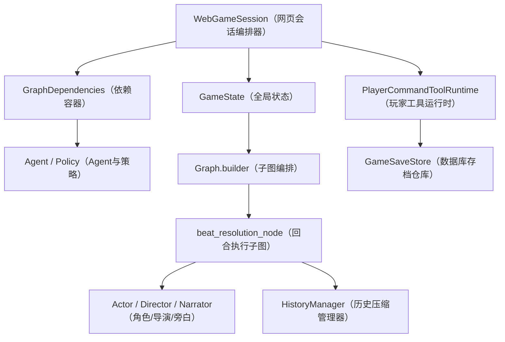

# 详细设计

## 1. 项目定位

### 1.1 一句话介绍

`easy_game` 是一个面向修仙题材的 AI 互动叙事引擎。它不是把整个上下文一次性丢给大模型做“续写”，而是把故事规划、舞台调度、角色行动、玩家输入解析、记忆压缩、工具调用、存档查询拆成多个模块，再用状态图把这些模块串起来。

### 1.2 面试时可以先这样开场

> 这个项目的核心目标，是把“可玩性”和“可控性”放在“生成感”前面。我把系统拆成了状态中心、图编排、角色 Agent、记忆系统、工具系统和持久化系统几层，让它既能用 LLM 生成剧情，又能在没有模型时用规则兜底，方便测试、调试和后续扩展。

### 1.3 项目关键词

- `GameState`（全局游戏状态）：所有节点共享的唯一状态对象。
- `GraphDependencies`（运行依赖容器）：存放 Agent、策略、工具运行时，不把这些不可序列化对象塞进状态里。
- `agent-first`（优先走 Agent 模式）：优先调用大模型生成剧情与角色行动。
- `heuristic`（启发式兜底模式）：不依赖模型，用本地规则保证流程可运行。
- `WebGameSession`（网页会话编排器）：负责玩家交互、自动推进 NPC、工具调用和序列化输出。

## 2. 版本演进

### 2.1 V1 历史版本

第一版更像“一个会续写文本的后端”。

- `GameState`（全量状态）会被整体拼进 Prompt，每轮都把全部信息重新喂给模型。
- 玩家查询类操作直接走数据库，不经过统一的工具系统。
- 记忆更像 `FIFO`（先进先出队列），只保留最近若干条对话，token 成本高，而且角色缺少稳定长期判断。
- 当时 LLM 更像一个“智能文本接口”，系统性不足，可解释性和可测试性都比较弱。

### 2.2 V2 当前版本

当前版本已经变成“多模块协作的状态机系统”。

- 用 `GameState`（全局状态）统一承载剧情、场景、角色、历史、记忆和玩家输入。
- 用 `Graph.builder`（图编排入口）把故事准备、章节准备、回合执行、场景切换串成子图。
- 用 `CharacterMemoryState`（角色记忆）和 `MemoryState`（全局压缩记忆）做双层记忆。
- 用 `PlayerCommandToolRuntime`（玩家工具运行时）和 `ToolSkillRegistry`（工具技能注册表）统一工具调用入口。
- 用 `GameSaveStore`（存档仓库）把会话快照和结构化查询能力接入数据库。

### 2.3 V3 后续规划

- 用更强的 `HistorySummarizerAgent`（历史摘要 Agent）替换更多规则式摘要。
- 继续增强角色层级晋升，例如让 `L2`（重点配角）在特定剧情条件下升级成 `L1`（核心角色）。
- 让前端补上更完整的可视化调试面板，比如记忆视图、导演调度视图、工具调用轨迹。

## 3. 面试视角下的总体架构

### 3.1 我怎么拆这个系统

我把项目拆成六层：

1. `GameState`（状态层）：描述当前故事世界发生了什么。
2. `Graph`（编排层）：决定下一步该跑哪个节点。
3. `Agent` / `Policy`（生成与决策层）：负责剧情规划、角色行动、调度和解析。
4. `Memory`（记忆层）：压缩历史，给不同模块喂不同视角的上下文。
5. `Tool`（工具层）：让玩家和故事 Agent 以受控方式查询状态或执行操作。
6. `Persistence`（持久化层）：把运行时状态和数据库世界状态同步起来。

### 3.2 架构图

### 3.3 这样拆的原因

- `state`（状态）和 `deps`（依赖）分离后，状态更容易测试、序列化和存档。
- `Graph`（编排层）负责流程，`Agent`（生成层）负责内容，职责边界更清楚。
- `heuristic`（启发式模式）存在后，我可以离线验证流程正确性，不会被模型波动拖住开发效率。

## 4. 核心状态模型

### 4.1 为什么以 `GameState` 为中心

面试里我会强调一句话：这个项目不是“函数到处传参”，而是“所有节点围绕一个统一状态对象做纯函数式更新”。

这样做的好处是：

- 节点输入输出统一。
- 子图可以自由组合。
- 存档和回放天然方便。
- 单元测试可以只构造一个最小 `state`（状态）就验证逻辑。

### 4.2 `GameState` 结构总览

| 变量名 | 中文解释 | 主要职责 |
| --- | --- | --- |
| `plot` | 剧情主线状态 | 管章节、剧情主目标、剧情标记、境界推进 |
| `scene` | 当前场景状态 | 管地点、时间、舞台张力、在场角色 |
| `characters` | 角色运行时状态表 | 管每个角色的情绪、意图、关系变化、角色记忆 |
| `history` | 历史事件列表 | 记录已经发生的对白、动作、系统消息 |
| `runtime` | 回合运行时状态 | 记录当前轮次、下一个行动者、旁白队列、结束标记 |
| `scene_plan` | 当前场景计划 | 描述这一幕要发生什么、不能发生什么 |
| `director_brief` | 导演调度简报 | 给本轮节奏、焦点角色、响应者建议 |
| `memory` | 全局压缩记忆 | 给导演、编剧、调度器提供摘要上下文 |
| `player` | 玩家状态 | 管玩家控制角色、最后输入和解析后的动作 |

### 4.3 `plot` 里的关键字段

| 变量名 | 中文解释 | 面试时怎么讲 |
| --- | --- | --- |
| `chapter_id` | 当前章节编号 | 当前跑到哪一章 |
| `scene_id` | 当前场景编号 | 当前章节里正在执行哪一幕 |
| `chapter_goal` | 当前章节目标 | 这章要解决什么问题 |
| `plot_flags` | 剧情标记字典 | 记录重要条件是否触发，方便后续分支判断 |
| `story_premise` | 故事前提 | 故事最上层的世界设定和主驱动力 |
| `story_outline` | 故事大纲列表 | 编剧 Agent 产出的章节级规划结果 |
| `current_chapter_title` | 当前章节标题 | 用于前端展示和剧情组织 |
| `cultivation_goal` | 修行总目标 | 修仙题材下的大方向目标 |
| `current_player_realm` | 玩家当前境界 | 玩家现实进度 |
| `current_chapter_realm` | 本章目标境界阶段 | 当前章节围绕哪个境界阶段展开 |
| `next_chapter_realm` | 下一章目标境界 | 章节推进的下一站 |
| `chapter_transition_requirement` | 章节切换条件 | 进入下一章前必须满足的条件 |
| `completed_chapters` | 已完成章节归档 | 方便回顾和长线剧情总结 |

### 4.4 `scene` 里的关键字段

| 变量名 | 中文解释 | 主要含义 |
| --- | --- | --- |
| `location_id` | 场景地点标识 | 当前舞台发生在哪里 |
| `time_tag` | 时间标签 | 清晨、夜晚等氛围信息 |
| `beat` | 当前节拍 | 这一小段戏的核心状态 |
| `tension` | 张力值 | 控制节奏强弱和收束时机 |
| `focus_character` | 焦点角色 | 导演当前希望聚焦谁 |
| `on_stage` | 在场角色列表 | 谁现在能参与这幕戏 |
| `allow_interrupt` | 是否允许打断 | 控制是否能插话、抢节奏 |
| `suppressed` | 暂时压制角色列表 | 当前不建议出手的角色 |

### 4.5 `runtime` 里的关键字段

| 变量名 | 中文解释 | 主要含义 |
| --- | --- | --- |
| `turn_index` | 当前回合序号 | 每结算一次动作就递增 |
| `last_actor` | 上一个行动者 | 用于回顾上一轮是谁行动 |
| `last_mode` | 上一个行动模式 | 说话、动作、事件等 |
| `eligible_actors` | 当前可行动角色 | 调度器的候选池 |
| `pending_intro_kind` | 待输出引导类型 | 开场、章节开场、场景开场等 |
| `pending_beat_actors` | 当前节拍待行动角色 | 一个 beat 内还没完成行动的角色 |
| `beat_fallback_turns_remaining` | 节拍兜底回合数 | 避免 beat 太早收掉 |
| `narration_queue` | 旁白待生成队列 | 把结构化动作转成叙事文本前的缓冲区 |
| `scene_candidates` | 场景候选列表 | 当前章可切换的下一幕候选 |
| `next_act` | 下一个计划动作 | 调度器挑出的下一步行动 |
| `resolved_act` | 已解析动作 | 角色或玩家真正执行后的标准化动作 |
| `scene_finished` | 场景是否结束 | 场景收束标记 |
| `chapter_finished` | 章节是否结束 | 章节收束标记 |

### 4.6 `player` 里的关键字段

| 变量名 | 中文解释 | 主要含义 |
| --- | --- | --- |
| `enabled` | 玩家控制是否开启 | 是否由玩家接管某个角色 |
| `controlled_character` | 玩家控制角色 id | 玩家到底在扮演谁 |
| `last_input` | 最近一次玩家输入 | 玩家原始文本输入 |
| `last_parsed_act` | 最近一次解析后的玩家动作 | 把自然语言变成结构化动作后的结果 |

## 5. 初始化流程

### 5.1 入口函数

启动一局故事时，主线入口集中在 `session_bootstrap.py`：

1. `build_player_profile`（构建玩家档案）：生成玩家默认人设、境界、功法、背包等信息。
2. `build_default_character_profiles`（构建默认角色档案表）：至少先生成玩家档案。
3. `build_default_scene_config`（构建默认场景配置）：定义初始地点、退出条件、叙事风格。
4. `build_default_state`（构建默认游戏状态）：生成最初的 `GameState`（全局状态）。
5. `build_graph_dependencies`（构建图依赖）：把 Agent、历史管理器、玩家接口和策略装进 `GraphDependencies`（依赖容器）。

### 5.2 关键初始化变量

| 变量名 | 中文解释 | 作用 |
| --- | --- | --- |
| `character_profiles` | 角色档案表 | 存角色静态信息和分层信息 |
| `scene_config` | 场景配置 | 描述开场舞台和退出条件 |
| `player_context` | 玩家开场上下文 | 把玩家境界、背景、灵根等整理成剧情开场输入 |
| `deps` | 运行依赖 | 给图节点提供 Agent、策略和工具 |
| `agent_first` | 是否启用 Agent 优先模式 | 决定是更多依赖模型还是更多依赖规则 |

### 5.3 面试时可以强调的点

- 初始化阶段就把“静态档案”和“动态状态”分开了。
- `character_profiles`（角色档案）更偏配置，`state["characters"]`（角色运行时状态）更偏实时变化。
- `deps`（依赖）里放的是不可序列化对象，`state`（状态）里放的是可回放、可存档的数据。

## 6. 一轮故事是怎么跑起来的

### 6.1 节点是怎么构建出来的

如果面试官继续追问“这些节点和子图在代码里到底怎么搭出来的”，我会补这一层实现细节。

这套 Graph 的节点构建可以概括成 4 步：

1. 先把节点清单按子图分组
2. 再把 `deps`（依赖容器）绑定进每个节点
3. 然后把节点列表编译成 `StateGraph` 或本地顺序 runner
4. 最后再把子图当成更大的节点继续往上拼装

也就是说，**子图本身也是节点，节点和子图用的是同一套组装思路。**

#### 1. 节点清单怎么定义

在 `Graph/builder.py` 里，我先用元组把每个子图的节点顺序定义出来：

| 变量名 | 中文解释 | 作用 |
| --- | --- | --- |
| `STORY_AUTHORING_NODES` | 故事创作节点清单 | 管故事前提、大纲、角色阵容和大纲修订 |
| `CHAPTER_PREPARATION_NODES` | 章节准备节点清单 | 管章节扩写、章节开场、历史刷新、场景候选 |
| `SCENE_DIRECTION_NODES` | 场景调度节点清单 | 管导演和调度器 |
| `TRANSITION_NODES` | 转场节点清单 | 管场景切换、章节归档、章节切换 |

这种写法的好处是：  
节点顺序是显式的，后续不管是编译图还是顺序执行，都复用同一份节点声明，不会出现“图的定义”和“直接执行逻辑”写成两套代码的问题。

#### 2. `deps` 是怎么绑定进节点的

虽然节点函数大多长得像 `xxx_node(state, deps)`，但真正编译成图时，图里希望拿到的是“只吃 state 的节点”。

所以我在 `builder.py` 里做了两层轻量封装：

| 函数名 | 中文解释 | 作用 |
| --- | --- | --- |
| `_bind_graph_nodes` | 绑定图节点 | 用 `partial` 预先把 `deps` 绑定到节点上 |
| `_compile_bound_nodes` | 编译已绑定节点 | 把绑定后的节点列表交给图编译器 |
| `_run_story_steps` | 顺序执行步骤 | 在不编译图时，按同样顺序直接执行节点 |

这一步的本质是：  
**把“依赖注入”从图执行本身里剥离出来。**

这样做有两个好处：

- `state` 保持纯数据结构，方便存档和测试。
- `deps` 可以在不同运行模式下灵活替换，比如 `agent-first` 和 `heuristic`。

#### 3. 子图是怎么被编译的

真正负责把节点列表变成图的是 `compile_graph_with_nodes`。

它的逻辑很简单：

1. 尝试导入 `langgraph`
2. 如果存在，就创建 `StateGraph(GameState)`
3. 把节点按顺序 `add_node`
4. 把第一个节点设为入口
5. 按顺序给相邻节点连边
6. 最后把最后一个节点连到 `END`

也就是说，当前这套子图整体是**线性编排**，不是复杂分叉图。  
复杂的条件判断主要收在节点内部，而不是大量写在图边上。

#### 4. 为什么还保留 fallback runner

`compile_graph_with_nodes` 还有一个很实用的设计，就是支持 `fallback_to_runner=True`。

这意味着：

- 如果安装了 `langgraph`，就走正式图编译流程
- 如果没有安装，也可以退回到本地顺序执行器

这样做的价值很大：

- 本地调试更轻
- 单元测试更稳定
- 某些子图即使不依赖图框架，也能直接运行

最典型的例子就是 `beat_execution_subgraph`，它在图模式和本地 runner 模式下都能保持同样的执行顺序。

#### 5. 子图为什么还能继续往上拼

在这套设计里，子图构建完成后，本身就可以当作一个更大的节点来用。

比如：

- `build_story_setup_subgraph` 里，会把 `story_authoring_subgraph.invoke` 当成前置节点，再接 `story_intro`
- `build_chapter_runtime_subgraph` 里，会把 `chapter_preparation_subgraph.invoke`、`scene_direction_subgraph.invoke`、`transition_subgraph.invoke` 当成更高一层的节点
- `build_game_graph` 里，再把 `story_setup_subgraph.invoke` 和 `chapter_runtime_subgraph.invoke` 串成总图

所以它的组装方式是递归的：

- 先拼节点
- 再拼子图
- 最后拼总图

#### 6. 为什么我还保留 `prepare_story_setup` 这类直接执行函数

除了 `build_xxx_subgraph` 这类图构建函数，我还保留了：

- `prepare_story_setup`
- `prepare_chapter_turn`
- `resolve_story_turn`
- `initialize_story_session`

这些直接执行函数。

这是因为在 Web 会话、命令行 demo、单元测试里，有时并不需要真的把全图编译出来，而是只想“按同样的业务顺序跑一步”。

所以这套架构实际上提供了两种执行方式：

| 方式 | 适用场景 |
| --- | --- |
| 图编译执行 | 适合完整流程编排和正式运行 |
| 直接顺序执行 | 适合测试、调试和局部推进 |

### 6.2 顶层流程

`Graph.builder`（图编排入口）把整个故事流程拆成几个子图：

| 函数名 | 中文解释 | 主要职责 |
| --- | --- | --- |
| `build_story_authoring_subgraph` | 故事创作子图 | 生成故事前提、大纲和角色阵容 |
| `build_story_setup_subgraph` | 故事初始化子图 | 完成开场前的整体设定 |
| `build_chapter_preparation_subgraph` | 章节准备子图 | 扩写章节、生成章节开场、刷新历史、生成场景候选 |
| `build_scene_direction_subgraph` | 场景调度子图 | 导演更新舞台，调度器选择下一个行动者 |
| `build_chapter_runtime_subgraph` | 章节运行子图 | 串起准备、调度、回合执行和转场 |
| `build_game_graph` | 总图入口 | 拼成完整游戏流程 |

### 6.3 一次完整回合

实际执行时，一轮故事推进通常会走下面这条线：

1. `prepare_story_setup`（准备故事设定）：生成 `story_premise`（故事前提）、`story_outline`（故事大纲）、角色阵容和开场旁白。
2. `prepare_chapter_turn`（准备当前章节）：扩写当前章，生成 `scene_candidates`（场景候选）并刷新历史记忆。
3. `director_node`（导演节点）：根据场景目标、焦点角色和历史记忆生成 `director_brief`（导演简报）。
4. `scheduler_node`（调度节点）：根据 `eligible_actors`（可行动角色）和舞台状态决定 `next_act`（下一个动作）。
5. `beat_resolution_node`（节拍执行节点）：进入一个 beat 的实际执行循环。
6. `transition_subgraph`（转场子图）：如果场景结束或章节结束，就做场景切换、章节归档和下一章准备。

### 6.4 `beat_resolution_node` 内部在干什么

`beat_resolution_node`（节拍执行节点）是最核心的“战斗室”。

它内部会依次调用：

| 函数名 | 中文解释 | 主要职责 |
| --- | --- | --- |
| `director_lead_in_node` | 导演引导节点 | 先给这一拍一个开场导语 |
| `actor_node` | 角色执行节点 | 判断是玩家回合还是 NPC 回合，并生成动作 |
| `history_commit_node` | 历史提交节点 | 把动作写进历史、关系和角色状态 |
| `contextual_progression_node` | 上下文推进节点 | 推进场景语义状态，比如谁上场谁离场 |
| `narration_subgraph_node` | 旁白生成子图 | 把结构化动作转成可展示文本 |
| `cultivation_progress_node` | 修行进度节点 | 识别修炼、突破等与修仙题材强相关的进展 |
| `scene_end_node` | 场景结束判定节点 | 判断这一幕是否应该收束 |
| `refresh_history_node` | 历史刷新节点 | 更新压缩记忆，给下一轮继续用 |

### 6.5 回合循环为什么要单独做成子图

- 每一拍的结构高度稳定，很适合做成一个固定流水线。
- 这样 `director`（导演）、`actor`（角色）、`narration`（旁白）、`memory`（记忆）之间的边界清晰。
- 后续如果要插入新节点，比如“战斗结算”或“任务进度同步”，只需要在 beat 子图里扩展。

### 6.6 谁决定下一个行动者

这部分在面试里很容易被问到，我会特别强调：  
**真正决定 `next_act`（下一步动作）的，不是编剧 Agent 单独决定，也不是导演 Agent 一个人拍板，而是“编剧提供叙事约束，导演给出响应建议，Scheduler 最终落成行动者”。**

也就是说，这里其实是三层接力：

| 组件 | 中文解释 | 决策职责 |
| --- | --- | --- |
| `PlaywrightAgent` | 编剧 Agent | 决定这场戏应该往哪推进，给出场景目标和约束 |
| `DirectorAgent` | 导演 Agent | 根据当前舞台状态决定这一拍谁更应该回应 |
| `SchedulerPolicy` | 调度策略 | 把导演建议和当前运行时状态落成 `runtime.next_act` |

#### 1. 编剧 Agent 根据什么做判断

编剧 Agent 不直接决定“下一秒谁说话”，它更像上层叙事规划者。  
它主要基于：

- `plot.story_premise`（故事前提）
- `plot.story_outline`（章节大纲）
- 当前章节条目和章节目标
- `scene_config`（场景配置）
- `character_profiles`（角色档案）
- 当前 `state`（游戏状态）里的剧情、场景和历史上下文

它产出的关键不是 `next_act`，而是这些中间结果：

- `scene_plan.scene_goal`（当前场景目标）
- `scene_plan.must_happen`（必须发生的事）
- `scene_plan.must_not_happen`（不能发生的事）
- `scene_plan.dramatic_curve`（戏剧曲线）
- `scene_plan.character_objectives`（角色目标）
- `runtime.scene_candidates`（场景候选）

所以编剧 Agent 的作用可以概括成一句话：  
**它决定这场戏应该怎么演，而不是决定这一秒该轮到谁开口。**

#### 2. 导演 Agent 根据什么给出“谁该回应”的建议

导演 Agent 是真正接近运行时调度的一层。  
它会综合下面这些信息来生成 `director_brief`（导演简报）：

- `plot`（章节、故事前提、章节目标、章节概览）
- `scene`（地点、时间、当前 beat、张力、焦点角色、在场角色）
- `scene_plan`（场景目标、必须发生/不能发生的事、角色目标）
- `memory.director_memory`（导演视角的压缩记忆）
- `history`（最近几条历史）
- `characters_on_stage`（当前在场角色状态）
- `available_stage_candidates`（当前可拉入舞台的角色）
- `stage_tiers`（L1、L2、actor 的分层情况）
- `character_roster_snapshot`（角色名册快照）
- `conflict_transition_profile`（当前是否处于冲突升温状态）

导演 Agent 最重要的输出字段是：

| 字段名 | 中文解释 | 作用 |
| --- | --- | --- |
| `beat` | 当前这一拍的戏 | 定义这一拍的核心状态 |
| `beat_goal` | 当前这一拍的目标 | 这一拍要推进到哪里 |
| `focus_character` | 焦点角色 | 当前舞台希望聚焦谁 |
| `tension_target` | 目标张力 | 控制节奏强度 |
| `who_should_respond` | 建议回应角色列表 | 导演认为这拍应该优先回应的角色顺序 |
| `stage_actions` | 舞台动作 | 控制进场、离场、压制、解除压制 |

所以导演 Agent 的本质是：  
**根据当前舞台和剧情压力，先排出“这一拍谁更该回应”的优先级。**

#### 3. Scheduler 怎么把导演建议落成最终行动者

导演的输出还不是最终 `next_act`，它还要经过 `SchedulerPolicy`（调度策略）这一层。

`apply_director_brief` 会先把导演简报写回状态，主要做三件事：

1. 应用 `stage_actions`，更新 `scene.on_stage` 和 `scene.suppressed`
2. 更新 `scene.focus_character`、`scene.tension` 等舞台状态
3. 生成：
   `runtime.pending_beat_actors`（导演建议本拍优先响应的人）
   `runtime.eligible_actors`（当前真正可行动的人）

接着 `scheduler_node` 再基于这些字段决定 `runtime.next_act`。

它的决策顺序可以概括为：

1. 如果场景已经结束，不再选行动者
2. 先算 `eligible_actors = on_stage - suppressed`
3. 如果 `pending_beat_actors` 不为空，优先选导演排在最前面的角色
4. 如果导演没有明确候选，但当前 beat 还允许兜底回合，就优先考虑 `focus_character`
5. 同时尽量避免和 `last_actor`（上一个行动者）连续重复，除非场上只剩一个角色

也就是说，调度器不是凭空决定，而是在：

- `director_brief`（导演建议）
- `scene.focus_character`（当前焦点）
- `runtime.last_actor`（上一手是谁）
- `scene.on_stage`（谁在场）
- `scene.suppressed`（谁被压制）

这些信息的基础上，把“建议”变成“真正的下一手”。

#### 4. 这一套设计为什么合理

我这样拆的原因，是为了让职责边界足够清楚：

- 编剧 Agent 负责“叙事方向”
- 导演 Agent 负责“舞台优先级”
- Scheduler 负责“最终行动落点”

如果把这三层揉成一个节点，就会出现两个问题：

- 高层剧情目标和当前一拍的局部调度容易混在一起
- 测试会很难做，因为很难判断到底是哪一层决策出了问题

#### 5. 面试时我会怎么总结这段

> 这套系统里，编剧 Agent、导演 Agent 和 Scheduler 是分层决策的。编剧 Agent 不直接决定谁马上行动，它主要定义当前场景目标、必须发生和不能发生的事，也就是把这场戏的边界画出来。导演 Agent 再基于当前舞台、最近历史、导演记忆、角色分层和冲突强度，生成 `DirectorBrief`，尤其是 `who_should_respond` 和 `focus_character`。最后由 Scheduler 结合 `pending_beat_actors`、`eligible_actors`、焦点角色和上一手行动者，真正落成 `runtime.next_act`。所以可以理解成：编剧决定戏往哪走，导演决定谁该回应，Scheduler 决定这一步到底轮到谁。`

## 7. 角色分层与 Agent 设计

### 7.1 角色为什么要分层

我把角色分成三层，不是为了炫技，而是为了控制“角色重要性”和“token 成本”。

| 角色层 | 变量名 | 中文解释 | 使用场景 |
| --- | --- | --- | --- |
| 通用角色 | `actor` | 普通角色层 | 路人、可替换角色、一次性角色 |
| 重点配角 | `L2` | 支撑剧情但不主导全局 | 师兄、长老、同伴、关键 NPC |
| 核心角色 | `L1` | 核心主线角色层 | 主角、宿敌、关键反派、持续主线人物 |

### 7.2 三层角色的区别

- `ActorAgent`（通用角色 Agent）更强调“当前场景能不能顺利演下去”。
- `L2ActorAgent`（重点配角 Agent）会参考 `l2_profile`（轻量配角画像），例如 `core_drive`（核心驱动力）、`behavior_rule`（行为规则）。
- `L1ActorAgent`（核心角色 Agent）会更重视 `l1_profile`（核心角色画像）和更深的长期记忆，保证人物弧光连续。

### 7.3 角色档案里最值得讲的字段

| 变量名 | 中文解释 | 价值 |
| --- | --- | --- |
| `agent_type` | Agent 类型 | 决定这个角色走哪种生成逻辑 |
| `story_layer` | 故事层级 | 区分玩家、普通角色、L2、L1 |
| `storage_mode` | 存储模式 | 决定是玩家私有实例还是共享模板 |
| `layer_assignment` | 分层分配信息 | 解释这个角色为什么被判定为核心/配角 |
| `memory_profile` | 记忆配置 | 控制不同层角色拿到多少记忆 |
| `l2_profile` | L2 画像 | 轻量但稳定地控制配角行为 |
| `l1_profile` | L1 画像 | 让核心角色具备更强内在冲突和持续性 |

### 7.4 `ComponentFactory` 的作用

`ComponentFactory`（组件工厂）统一负责创建各类 Agent 和 Policy。

它的好处是：

- 延迟导入，降低启动开销。
- 统一构造参数，便于替换实现。
- 测试时更容易注入假对象。

## 8. 记忆系统设计

### 8.1 为什么做双层记忆

这个项目最大的痛点之一，是互动叙事天然会越来越长。如果始终把全量历史喂给模型，成本高，而且角色不一定真的“记住重点”。

所以我把记忆拆成两层：

1. `CharacterMemoryState`（角色本地记忆）：每个角色自己的主观记忆。
2. `MemoryState`（全局压缩记忆）：系统层面对剧情历史的摘要视图。

### 8.2 `CharacterMemoryState` 结构

| 变量名 | 中文解释 | 作用 |
| --- | --- | --- |
| `pinned_long_term_memory` | 钉住的长期记忆 | 绝不能轻易忘的关键事件 |
| `long_term_memory` | 长期记忆 | 重要但还没固化的事件 |
| `consolidated_memory` | 归并记忆 | 长期记忆超限后形成的稳定判断 |
| `short_term_memory` | 短期记忆 | 最近场景和章节细节 |
| `player_memory` | 玩家印象记忆 | 角色对玩家的印象、关系和关键互动 |

### 8.3 角色记忆为什么不是简单 FIFO

我没有只保留最近 N 条，而是加了 `consolidation`（归并）这一步：

- 当 `long_term_memory`（长期记忆）超限时，旧事件不会直接删除。
- 旧事件会被压缩成 `consolidated_memory`（归并记忆）。
- 这样角色会形成“对某个人的稳定判断”或“对某件事的长期偏见”，而不是只记得最近几句话。

### 8.4 全局压缩记忆 `MemoryState`

| 变量名 | 中文解释 | 作用 |
| --- | --- | --- |
| `scene_memory` | 场景记忆 | 给前端和系统看这一幕发生了什么 |
| `playwright_memory` | 编剧记忆 | 给剧情规划用的摘要视图 |
| `director_memory` | 导演记忆 | 给舞台调度和焦点分配用 |
| `scheduler_memory` | 调度记忆 | 给下一行动者选择提供依据 |
| `last_compressed_turn` | 最近压缩到第几回合 | 避免重复压缩同一段历史 |

### 8.5 `HistoryManager` 是怎么工作的

`HistoryManager`（历史管理器）负责把 `history`（原始历史）变成 `memory`（压缩记忆）。

核心思路是：

1. 取出 `last_compressed_turn`（最后压缩回合）之后的新历史。
2. 给每条历史打重要性分数。
3. 高重要性的历史保留原文块 `raw`（原始块）。
4. 中低重要性的历史压成 `summary`（摘要块）。
5. 再基于这些压缩块，给导演、编剧、调度器生成不同视角的记忆。

### 8.6 面试里可以突出这一点

这个记忆系统不是“单纯省 token”，而是把“角色主观记忆”和“系统客观摘要”分开了。前者保证人物一致性，后者保证全局编排效率。

## 9. 玩家输入与工具系统

### 9.1 玩家输入为什么要分流

玩家输入不全是“剧情动作”，有时其实是“状态查询”。

比如：

- “打开背包”
- “看看我现在境界”
- “我和某个角色关系如何”
- “给我存档”

如果把这类输入也交给叙事 Agent 自由发挥，就容易失控。所以我做了单独的工具通道。

### 9.2 玩家输入链路

| 组件名 | 中文解释 | 作用 |
| --- | --- | --- |
| `BufferedPlayerInterface` | 玩家输入缓冲接口 | 暂存玩家动作，等待图执行消费 |
| `SemanticParserAgent` | 语义解析 Agent | 把自然语言转成标准动作 |
| `PlayerIntentPlannerAgent` | 玩家意图规划 Agent | 判断一句输入里是否包含工具调用和多步计划 |
| `PlayerCommandToolRuntime` | 玩家工具运行时 | 真正执行工具查询与存读档 |
| `ToolSkillRegistry` | 工具技能注册表 | 管工具定义、触发词和 Prompt 上下文 |

### 9.3 工具系统的核心变量

| 变量名 | 中文解释 | 作用 |
| --- | --- | --- |
| `PlayerToolCall` | 玩家工具调用结构 | 描述要不要调工具、调哪个工具、参数是什么 |
| `should_call` | 是否执行工具 | 防止误触发 |
| `name` | 工具名 | 标识具体执行哪个工具 |
| `arguments` | 工具参数 | 工具调用所需参数 |
| `reason` | 调用原因 | 给模型和日志提供可解释信息 |

### 9.4 当前玩家可用工具

| 工具名 | 中文解释 | 作用 |
| --- | --- | --- |
| `query_inventory` | 查询背包 | 读取玩家物品和数量 |
| `query_player_status` | 查询角色状态 | 查看属性、境界、当前场景 |
| `query_relation` | 查询关系 | 查看玩家和指定角色的关系分 |
| `query_quests` | 查询任务 | 查看当前进行中的任务 |
| `save_checkpoint` | 手动存档 | 保存当前会话快照 |
| `load_checkpoint` | 读取存档 | 从指定槽位恢复会话 |

### 9.5 为什么工具调用要写回 `history`

工具执行结果会被写成 `message_kind = "system"`（系统消息）的历史记录。

这样做有两个好处：

- 后续角色和旁白都能知道“系统刚刚返回了什么信息”。
- 工具结果也会进入记忆压缩流程，不会和剧情主线割裂。

### 9.6 Agent 工具访问控制

我没有让所有 Agent 随便调用所有工具，而是做了按受众划分的访问控制。

| 变量名 / 函数名 | 中文解释 | 作用 |
| --- | --- | --- |
| `ToolAudience` | 工具受众类型 | 区分 `player`（玩家）和 `story`（故事 Agent） |
| `tool_definitions_for_audience` | 按受众返回工具定义 | 确保不同身份只能看到对应工具 |
| `match_tool_definition` | 工具匹配函数 | 根据输入文本和受众匹配工具 |
| `select_story_tool_skill_ids` | 故事工具技能选择器 | 根据当前任务动态加载故事 Agent 可用工具 |
| `loaded_tool_skills` | 已加载工具技能 | 告诉故事 Agent 这次任务到底允许用哪些工具 |

这样做的价值是：

- 玩家只能调用玩家可见工具，避免权限失控。
- 编剧 Agent、导演 Agent、场景候选生成 Agent 只拿当前任务需要的工具，减少 Prompt 噪声。
- 工具权限是显式建模的，不是“模型想调什么就调什么”。

## 10. Web 会话与接口设计

### 10.1 `WebGameSession` 的职责

`WebGameSession`（网页会话编排器）是 Web 端真正的总控。

它负责：

- 初始化一局游戏。
- 自动推进 NPC，直到轮到玩家。
- 判断玩家输入是剧情动作还是工具请求。
- 在需要时保存和加载数据库存档。
- 把内部状态序列化成前端易消费的 JSON。

### 10.2 `WebGameSession` 中很关键的状态

| 变量名 | 中文解释 | 作用 |
| --- | --- | --- |
| `story_initialized` | 故事是否已经初始化 | 防止玩家还没进场就输入动作 |
| `last_handoff_reason` | 最近一次交接原因 | 告诉前端为什么现在轮到玩家 |
| `character_profiles` | 角色档案表 | 会话内共享的角色静态信息 |
| `scene_config` | 场景配置 | 当前会话使用的舞台配置 |
| `state` | 当前游戏状态 | 会话内的核心运行对象 |
| `deps` | 当前依赖容器 | 会话内的 Agent、工具和策略集合 |

### 10.3 Web API 设计

`web_server.py`（HTTP 服务）暴露的接口比较克制，重点是把“会话控制”和“存档能力”暴露出去：

| 接口 | 中文解释 | 作用 |
| --- | --- | --- |
| `GET /api/state` | 获取当前状态 | 前端刷新主界面 |
| `GET /api/players` | 获取用户存档列表 | 让用户选择存档槽位 |
| `POST /api/action` | 提交玩家动作 | 推进一轮故事 |
| `POST /api/reset` | 重置会话 | 用新设定重建开局 |
| `POST /api/new-game` | 创建新游戏 | 初始化并写入数据库 |
| `POST /api/save` | 手动保存 | 主动生成一条存档快照 |
| `POST /api/load` | 读取存档 | 恢复历史状态 |

## 11. 持久化设计

### 11.1 为什么数据库层不只存一个大 JSON

我虽然保存了完整快照，但没有只保存快照。

因为面试里经常会被问到一句：“如果玩家只想查背包或者查关系，你是不是每次都得把整个 JSON 读出来再解析？”

我的答案是：不是。我同时做了“完整快照 + 结构化投影”两套存储。

这里可以先把两者定义清楚：

| 存储形态 | 中文解释 | 核心目标 |
| --- | --- | --- |
| `完整快照` | 把一次会话几乎原样保存下来 | 保证整局游戏可以稳定读档恢复 |
| `结构化投影` | 从快照里抽取高频业务字段，写入结构化表 | 保证背包、关系、任务、角色名册等查询足够高效 |

如果只存 `完整快照`（完整 JSON），优点是恢复简单，但查询成本高。  
如果只存 `结构化投影`（拆开的业务表），优点是查询方便，但读档恢复会丢掉很多运行时上下文。

所以我的取舍是：

- `完整快照` 负责“恢复能力”。
- `结构化投影` 负责“查询能力”。

换成更工程化的话来说，前者更像 `write model`（写入真相），后者更像 `read model`（读取视图）。

### 11.2 `GameSaveStore` 的职责

`GameSaveStore`（存档仓库）负责：

- 建表。
- 新建存档槽位。
- 保存会话快照。
- 读取最新存档。
- 提供背包、状态、关系、任务、角色名册等查询接口。

在实现上，`GameSaveStore` 不是简单地“把 JSON 塞进数据库”，而是负责统一协调这两套存储。

你可以把它理解成持久化总入口：

| 函数名 | 中文解释 | 作用 |
| --- | --- | --- |
| `_save_player_snapshot` | 保存玩家快照主流程 | 同时驱动快照写入和结构化同步 |
| `load_player_session` | 读取玩家会话 | 从完整快照恢复整局状态 |
| `query_inventory` | 查询背包 | 直接走结构化投影，不解析整份快照 |
| `query_player_status` | 查询玩家状态 | 直接读取结构化字段 |
| `query_relation` | 查询角色关系 | 从角色实例或交互表中查关系 |
| `query_quests` | 查询任务 | 从任务投影表获取当前目标 |
| `query_character_roster` | 查询角色名册 | 查询当前玩家可见的角色结构 |

### 11.3 完整快照里存了什么

完整快照主要落在 `PlayerSaveSnapshot`（存档快照表）里，它保存的是“可以恢复整局游戏”的最小完整集合。

| 字段名 | 中文解释 | 作用 |
| --- | --- | --- |
| `game_state_json` | 游戏状态快照 | 保存当前 `GameState`（运行状态） |
| `character_profiles_json` | 角色档案快照 | 保存角色静态画像与分层信息 |
| `scene_config_json` | 场景配置快照 | 保存当前会话的舞台配置 |
| `session_config_json` | 会话配置快照 | 保存模式、玩家角色、叙事风格等 |
| `world_state_json` | 世界状态镜像 | 额外保存一份从快照抽出的世界状态 |
| `save_kind` | 存档类型 | 标记是新游戏、手动存档还是其他类型 |
| `save_label` | 存档标签 | 让用户可读地标识这条存档 |

这部分的核心作用，是保证未来调用 `load_player_session`（读取玩家会话）时，可以最大程度原样还原当时的运行状态。

### 11.4 结构化投影里存了什么

结构化投影的思路是：不把整个大 JSON 当成唯一查询入口，而是把真实业务会频繁访问的数据拆到专门的表里。

当前主要拆成下面几类：

| 表模型 | 中文解释 | 主要内容 |
| --- | --- | --- |
| `UserAccount` | 用户表 | 用户账号和展示名 |
| `PlayerSlot` | 玩家存档槽位表 | 当前玩家在哪个模式、在哪个场景、最近一次存档信息 |
| `PlayerWorldState` | 玩家世界状态表 | 世界标记、剧情标记、场景标记 |
| `PlayerStoryCharacter` | 玩家侧剧情角色表 | 和当前玩家绑定的剧情角色实例，主要承载 `L1/L2` 角色 |
| `PlayerActorInteraction` | 玩家与共享角色交互表 | 与普通 `actor` 模板角色的好感和交互状态 |
| `PlayerQuest` | 玩家任务表 | 当前任务、进度和来源 |
| `PlayerSaveSnapshot` | 存档快照表 | 完整 `state`、角色档案、场景配置、会话配置 |
| `StoryCharacterTemplate` | 共享角色模板表 | 供不同玩家复用的角色模板 |

这里有一个我觉得比较关键的拆分思路：

- `PlayerStoryCharacter`（玩家剧情角色实例）更适合存和玩家强绑定、持续发展的关键角色。
- `PlayerActorInteraction`（玩家与共享模板角色交互）更适合存普通 `actor` 角色的关系记录。

这样做能让“核心角色实例”和“普通模板角色”分层存储，后续扩展多人存档时不会全都揉在一起。

### 11.5 保存时两套存储怎么协同

这部分是面试官很容易继续追问的重点。

我这里不是维护两套彼此独立的数据源，而是以 `session_snapshot`（会话快照）为唯一来源，在一次保存流程里同时生成两类结果。

保存链路可以拆成下面 4 步：

1. `apply_snapshot_to_player_row`（应用快照到玩家槽位）
   把会话配置、当前场景、背包、玩家属性、交接原因等摘要信息同步到 `PlayerSlot`。
2. `upsert_world_state` / `upsert_story_characters` / `upsert_actor_interactions` / `upsert_player_quests`
   把世界状态、角色实例、关系交互、任务这些业务数据投影到结构化表。
3. `insert_snapshot`（插入快照）
   把完整 `state`、`character_profiles`、`scene_config`、`session` 写入 `PlayerSaveSnapshot`。
4. 更新 `latest_snapshot_id`（最新快照 id）
   让当前槽位总能指向最新的一条完整存档。

也就是说，结构化投影不是手工维护的第二套真相，而是“从这一次完整快照中推导出来的读取视图”。

这样设计的好处是：

- 一致性更好，因为两边来自同一个时刻的数据。
- 逻辑更清楚，因为快照仍然是恢复的最终依据。
- 后面即使结构化表扩展字段，也不影响旧快照的回档能力。

### 11.6 读取时怎么用这两套存储

读取同样分成两类场景：

#### 1. 读档恢复场景

如果用户要“回到上一次保存的完整局面”，就直接读取 `PlayerSaveSnapshot`（完整快照），然后通过 `load_player_session`（加载玩家会话）恢复 `GameState`、角色档案和场景配置。

这个场景的关键词是：**完整恢复**。

#### 2. 高频业务查询场景

如果用户只是想：

- 看背包
- 看人物关系
- 看任务
- 看当前状态
- 看角色名册

那就完全没有必要把整份快照读出来，而是直接查询结构化表。

这也是为什么我单独提供了：

- `query_inventory`（查询背包）
- `query_player_status`（查询状态）
- `query_relation`（查询关系）
- `query_quests`（查询任务）
- `query_character_roster`（查询角色名册）

这一层设计的核心价值，是把“读档恢复”和“业务查询”分开处理，避免所有请求都依赖大 JSON 解析。

### 11.7 结构化投影是怎么从快照里抽出来的

为了不让结构化同步逻辑直接散落在 `Store.py` 里，我又单独抽了一层“快照转投影”的转换函数。

| 函数名 | 中文解释 | 作用 |
| --- | --- | --- |
| `build_player_attributes` | 构建玩家属性投影 | 从玩家档案里抽属性、境界、功法等状态面板信息 |
| `build_world_state_payload` | 构建世界状态投影 | 从 `state` 中抽出 `plot`、`scene`、`runtime` 等全局状态 |
| `build_story_character_records` | 构建剧情角色记录 | 把 `L1/L2` 角色转成玩家绑定角色实例 |
| `build_actor_interaction_records` | 构建普通角色交互记录 | 把普通 `actor` 角色转成关系交互记录 |
| `build_player_quest_records` | 构建玩家任务记录 | 从章节目标、场景目标和导演目标生成任务视图 |

这里我想表达的重点是：

结构化投影不是简单“复制几列字段”，而是基于游戏运行语义重新组织了一层数据库读模型。

比如：

- `chapter_goal`（章节目标）、`scene_goal`（场景目标）、`beat_goal`（当前推进重点）会被重新整理成任务记录。
- `L1/L2` 角色和普通 `actor` 角色会分成不同投影路径。
- 玩家状态面板不是直接读原始档案，而是被整理成更适合查询的属性结构。

### 11.8 这套持久化设计的优点和代价

#### 优点

- 快照恢复简单，适合回档。
- 结构化查询高效，适合工具系统和前端直接读取。
- 快照和投影同时存在，既保留恢复能力，也保留业务可用性。
- 玩家专属角色和公共模板角色分离，扩展多人存档时会更自然。

#### 代价

- 数据会有一定冗余，因为同一份信息会以快照和投影两种形式出现。
- 写入链路会更复杂，因为一次保存要同步多张表。
- 需要额外保证快照和投影的生成顺序与一致性。

但我认为这是值得的，因为这个项目既是生成式系统，也是互动产品。  
它既要“能恢复”，也要“好查询”，所以双轨存储是一个比较稳妥的工程取舍。

### 11.9 面试时我会怎么总结这一段

> 我的持久化不是只存一个大 JSON，也不是只做关系表，而是做了“完整快照 + 结构化投影”双轨设计。完整快照保证整局游戏可以稳定读档恢复，结构化投影保证背包、关系、任务这类高频查询能直接走数据库。保存时两者都基于同一份会话快照生成，所以一致性也比较好。本质上是用一点写入复杂度，换恢复能力和查询效率。

## 12. 工程亮点与可测试性

### 12.1 工程亮点

1. `state`（状态）和 `deps`（依赖）分离，方便测试、回放和存档。
2. `heuristic`（规则模式）与 `agent-first`（模型优先模式）双通路共存，开发效率和线上体验兼顾。
3. `ComponentFactory`（组件工厂）+ `LazyImport`（延迟导入）降低初始化耦合。
4. `BaseAgent`（基础 Agent）内置 JSON 修复和降级逻辑，增强模型输出鲁棒性。
5. `prepare_chapter_turn`（章节准备）里对章节开场和场景候选生成做了并行化处理，减少等待时间。

### 12.2 JSON 解析策略

这个项目里很多核心节点都要求模型返回结构化 JSON，而不是随便返回一段自然语言。

`BaseAgent`（基础 Agent）里我做了三层保护：

| 函数名 | 中文解释 | 作用 |
| --- | --- | --- |
| `command` | 统一调用入口 | 优先请求结构化输出 |
| `_extract_json_text` | JSON 文本提取 | 把 markdown 包裹或多余文本剥掉 |
| `_repair_json_text_locally` | 本地 JSON 修复 | 对括号不闭合、尾逗号等常见问题做快速修复 |
| `_repair_json_response` | 模型二次修复 | 本地修不好时，再让模型专门返回合法 JSON |
| `_build_json_fallback_instruction` | JSON 降级提示构造 | 某些模型不支持 `response_format` 时，用提示词兜底 |

我这样设计的原因是：

- 叙事系统里最怕“流程跑到一半被格式问题卡死”。
- 结构化输出一旦稳定，后续的状态更新、测试和回放都会简单很多。
- 这个策略也体现了我不是只依赖 Prompt，而是在工程层面处理模型不稳定性。

### 12.3 测试覆盖

仓库里的 `tests/`（测试目录）已经覆盖了多条关键路径，包括：

- `test_beat_resolution.py`（回合执行测试）
- `test_character_memory_layers.py`（角色记忆分层测试）
- `test_player_command_tools.py`（玩家工具系统测试）
- `test_persistence_save_load.py`（存档读写测试）
- `test_story_authoring_subgraph.py`（故事创作子图测试）
- `test_prepare_chapter_turn_parallel.py`（章节准备并行测试）
- `test_session_bootstrap.py`（启动初始化测试）

面试里我会强调：这个项目不是“全靠 Prompt 撑起来”，而是关键流程都有可回归验证的代码路径。

## 13. 设计难点与取舍

### 13.1 难点一：长上下文与 token 成本

取舍方案：

- 不把完整历史每轮都塞给模型。
- 用 `CharacterMemoryState`（角色主观记忆）保证人物连续性。
- 用 `MemoryState`（系统压缩记忆）保证全局效率。

### 13.2 难点二：自由输入和可控系统之间的冲突

取舍方案：

- 玩家输入先进 `PlayerIntentPlannerAgent`（玩家意图规划 Agent）判断。
- 纯工具请求走 `PlayerCommandToolRuntime`（工具运行时）。
- 剧情动作才交给 `SemanticParserAgent`（语义解析 Agent）和回合图。

### 13.3 难点三：模型波动导致流程不稳定

取舍方案：

- 保留 `heuristic`（启发式兜底）路径。
- `BaseAgent`（基础 Agent）里对 JSON 输出做修复与降级。
- 调度、场景结束等关键决策尽量保留规则版策略。

### 13.4 难点四：角色数量增加后，主次关系容易混乱

取舍方案：

- 用 `actor` / `L2` / `L1`（三层角色能力）明确主次。
- 用 `layer_assignment`（分层分配信息）记录角色为什么属于这一层。
- 用不同 `memory_profile`（记忆配置）控制每层角色的上下文成本。

## 14. 面试时可重点讲的亮点

### 14.1 如果面试官问“你的核心设计点是什么”

可以回答：

> 我的核心设计点有三个。第一，我没有把它做成单一大 Prompt，而是做成了统一状态驱动的多节点图系统。第二，我把记忆拆成角色记忆和系统记忆两层，解决长上下文问题。第三，我保留了模型路径和规则路径两套能力，让它既能生成，又能稳定测试。

### 14.2 如果面试官问“为什么不用一个 Agent 全包”

可以回答：

> 因为一个 Agent 全包时，职责边界会非常模糊，调试和测试都很痛苦。我这里把剧情规划、导演调度、角色执行、玩家解析、旁白生成拆开，每个模块只关心自己那一层的输入输出，系统稳定性会好很多。

### 14.3 如果面试官问“你做这个项目最大的技术价值是什么”

可以回答：

> 我觉得最大的技术价值，不是把故事写出来，而是把 LLM 生成能力放进一个可测试、可存档、可扩展的工程框架里。这种框架化能力比单次生成效果更有长期价值。

## 15. 我建议你背熟的变量速查表

| 变量名 | 中文解释 | 你可以怎么解释 |
| --- | --- | --- |
| `state` | 当前全局状态 | 故事世界当前这一刻的完整数据快照 |
| `deps` | 依赖容器 | 不进存档的运行组件，比如 Agent、工具、策略 |
| `next_act` | 下一步计划动作 | 调度器决定下一个该谁行动、怎么行动 |
| `resolved_act` | 已解析动作 | 真正执行落地后的标准动作结构 |
| `plot_flags` | 剧情标记 | 控制支线和章节推进条件 |
| `scene_candidates` | 场景候选 | 当前章节接下来可切的场景集合 |
| `director_brief` | 导演简报 | 这一轮舞台应该聚焦谁、往哪推 |
| `scene_plan` | 场景计划 | 这一幕的目标、禁区和退出条件 |
| `eligible_actors` | 可行动角色 | 当前调度器能从谁里面选下一手 |
| `narration_queue` | 旁白队列 | 结构化动作转文本前的缓冲区 |
| `story_initialized` | 故事已初始化标记 | 防止会话还没建好就开始行动 |
| `last_handoff_reason` | 交接原因 | 告诉前端为什么现在轮到玩家 |
| `player_memory` | 玩家印象记忆 | 某个角色眼中的玩家是什么样的人 |
| `consolidated_memory` | 归并记忆 | 旧事件被压缩后形成的稳定认知 |
| `chapter_transition_requirement` | 章节切换条件 | 达到什么条件才算这一章可以结束 |

## 16. 总结

如果让我用一句更工程化的话总结这个项目，我会说：

> 这是一个基于统一状态模型、图式流程编排和双层记忆系统构建的 AI 互动叙事引擎。它既保留了 LLM 生成带来的内容弹性，又通过规则兜底、工具分流和持久化投影，把系统做成了一个可测试、可维护、可扩展的工程项目。

如果让我用一句更偏面试表达的话总结，我会说：

> 我这个项目最大的价值，不是“让模型写故事”，而是“把故事生成做成一个有架构、有状态、有测试、有存档能力的系统”。
